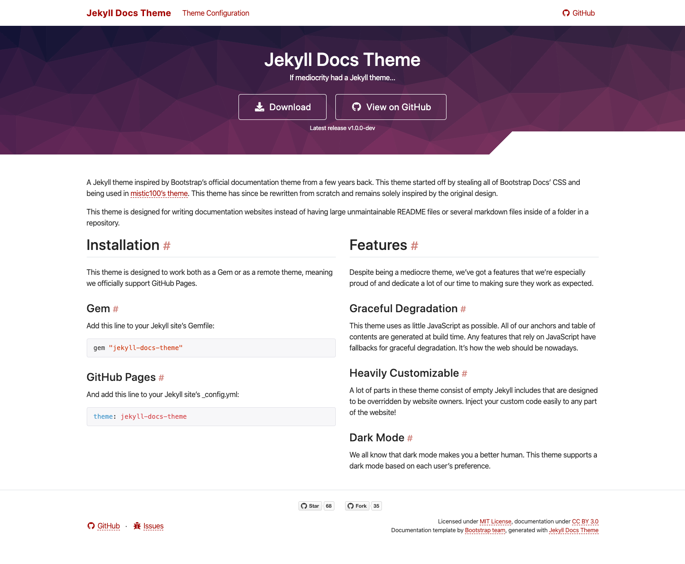
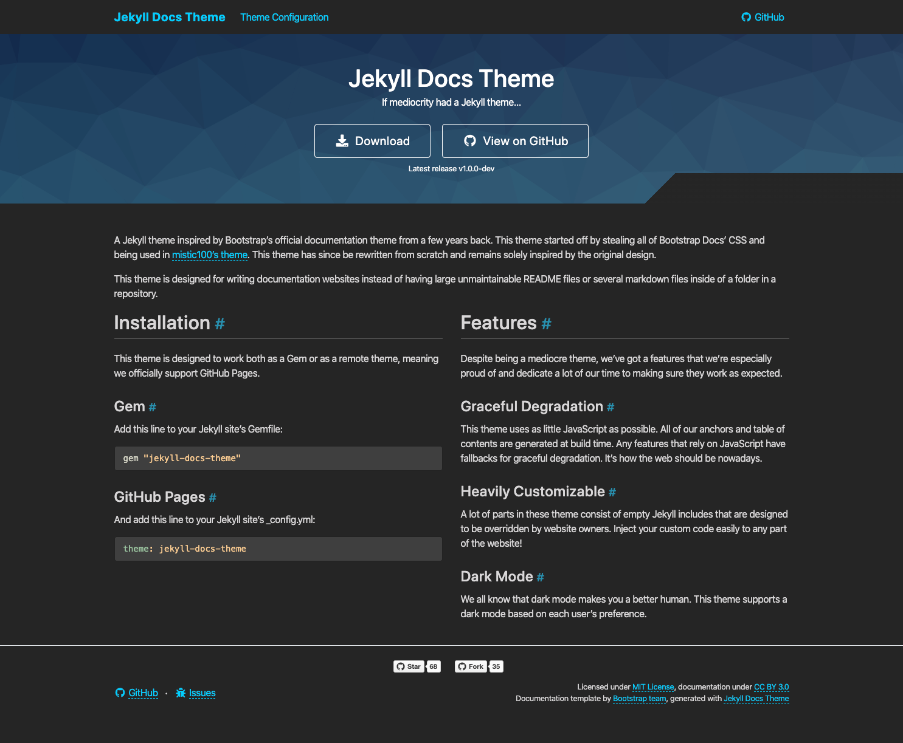

# Jekyll Docs Theme

A Jekyll theme inspired by Bootstrap's official documentation theme from a few years back. This theme started off by stealing all of Bootstrap Docs' CSS and being used in [mistic100's theme](https://github.com/mistic100/jekyll-bootstrap-doc). This theme has since be rewritten from scratch and remains solely inspired by the original design.

This theme is designed for writing documentation websites instead of having large unmaintainable README files or several markdown files inside of a folder in a repository.

## Screenshots

**Light Mode**

**Dark Mode**

## License

The theme is available as open source under the terms of the [MIT License](./LICENSE.md).
